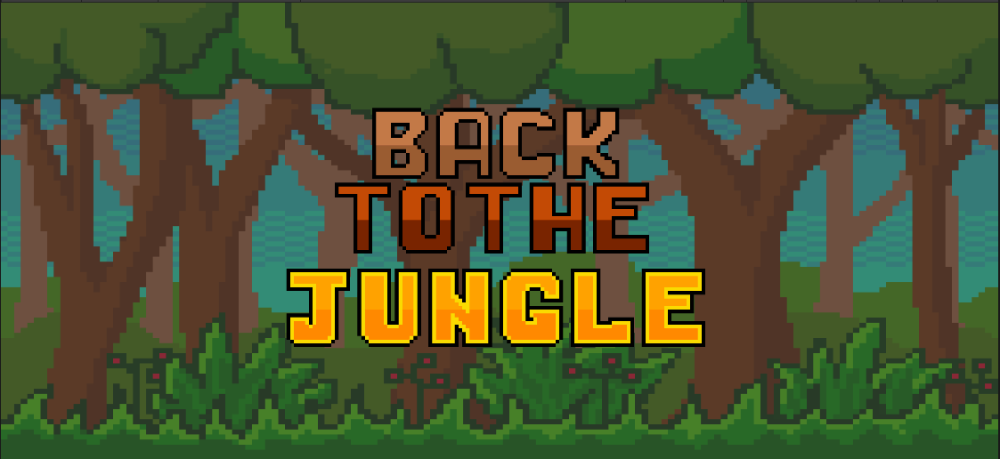
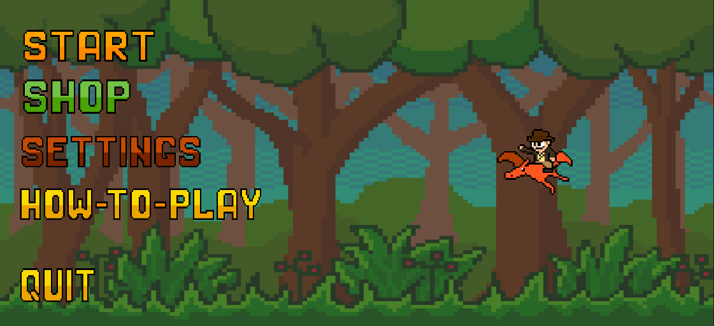
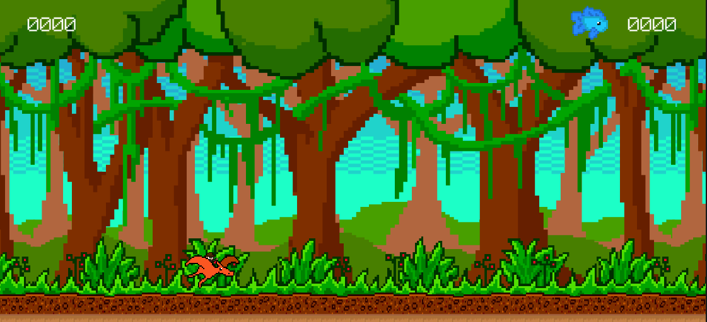
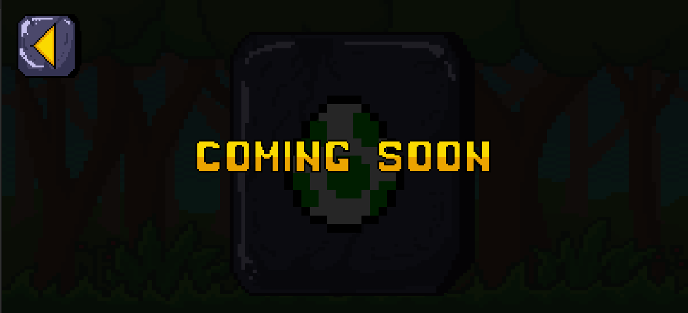
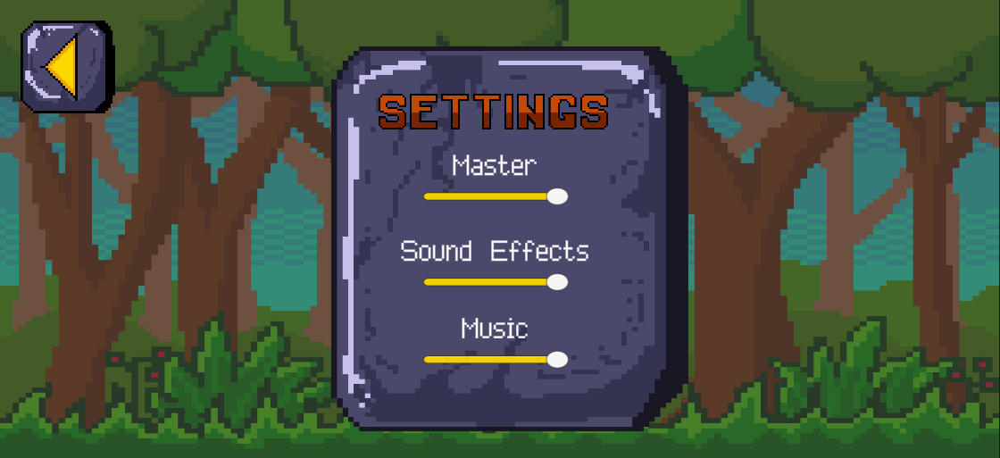
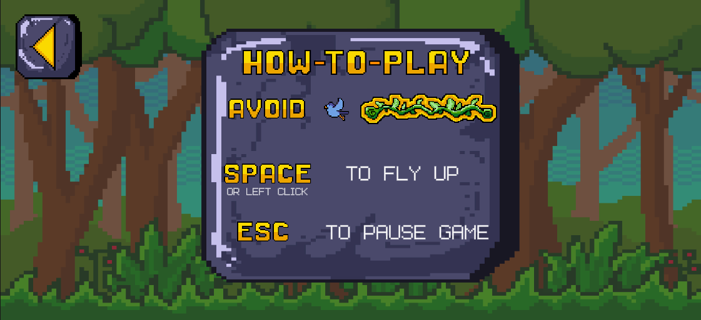
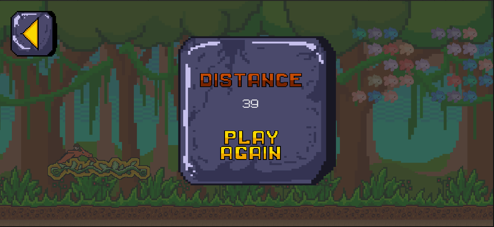
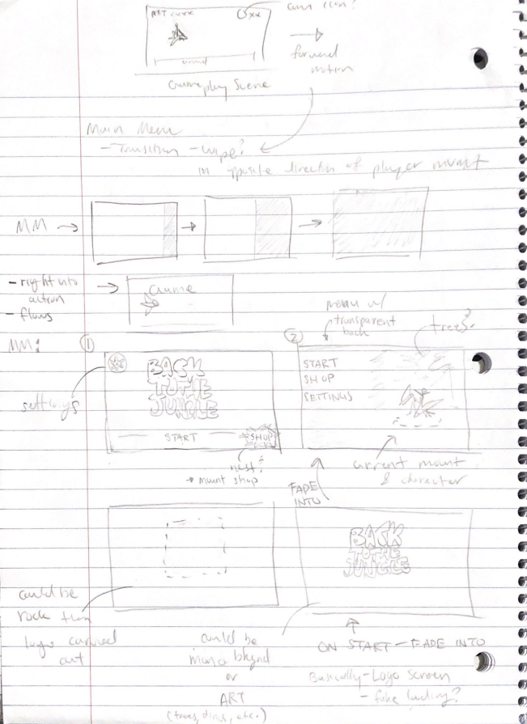
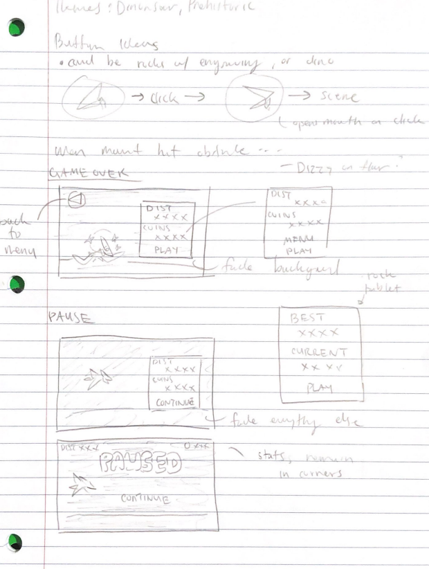

# Back to the Jungle

---

## Summary

Welcome Back to The Jungle! In a world where rogue scientists have time traveled and stolen a dinosaur from his home, your mission is to stop them. Rogue scientists have found a way to travel back in time. Return the dinosaur to his home- but watch out! There are vines and birds who really don't want you in their jungle. If they get you, you'll be returned to the rogue scientists' lab and you'll have failed your mission. Good luck vigilantes! Time is not on your side.

## Gameplay Explanation

**In this section, explain how the game should be played. Treat this as a manual within a game. It is encouraged to explain the button mappings and the most optimal gameplay strategy.**

**If you did work that should be factored in to your grade that does not fit easily into the proscribed roles, add it here! Please include links to resources and descriptions of game-related material that does not fit into roles here.**

---

## Quick Access

  
Main Roles

  <li><a href="#user-interface">User Interface</a></li>
  <li><a href="#movement-and-physics---william">Movement and Physics</a></li>
  <li><a href="#animation-and-visuals">Animation and Visuals</a></li>
  <li><a href="#input">Input</a></li>
  <li><a href="#game-logic">Game Logic</a></li>

  
Sub Roles

  <li><a href="#producer---william">Producer</a></li>
  <li><a href="#audio">Audio</a></li>
  <li><a href="#gameplay-testing">Gameplay Testing</a></li>
  <li><a href="#narrative-design">Narrative Design</a></li>
  <li><a href="#press-kit-and-trailer---william">Press-Kit and Trailer</a></li>
  <li><a href="#game-feel">Game Feel</a></li>

  
Notable Completions Outside of Role

  <li><a href="#member-william">William</a></li>

---

## Main Roles

### User Interface - [Westley](https://github.com/nwestl)

Our game has 7 different scenes connected by a LevelLoader script, the coding for this script was delegated to another member. Additionally in our gameplay scene, there are three different UI's: GameplayUI, EndScreenUI, and PauseScreenUI which are handled by the [GameplayManager.cs](https://github.com/beanbeanjuice/back-to-the-jungle/blob/4e25ce0b368f4d0fa16ddbc44c73377dddeb11ee/Jetpack/Assets/Scripts/Scenes/GameplayManager.cs). The logic in the script is referenced from [Brackeys](https://www.youtube.com/watch?v=JivuXdrIHK0&t=273s). 

When the player first loads up the game, they are greeted by the StartScreen scene which displays the title of our game. This then automatically loads with a crossfade animation into the StartMenu scene. Initially, I had two menu designs. One was inspired by mobile games with the title and menu buttons all in the same scene. The other was inspired by some PC games where the name of the game shows up separately to keep a clean main menu.

I opted for the second one as can be seen below.

Through the buttons on the StartMenu scene, one can access Gameplay, ShopMenu, SettingsMenu, and HowToPlay scenes with their respective buttons. I also added a Quit button which makes it easier for the user to exit out of the game build.

To update the gameplay UI seen below, I created a script [Score.cs](https://github.com/beanbeanjuice/back-to-the-jungle/blob/aefae8d1074b882c1bd2b60ad6f2ea91de202639/Jetpack/Assets/Scripts/Player/Score.cs) that uses get methods from the PlayerController to obtain the distance and score values to assign them the the TextMeshPro elements on screen. 

As can be seen below, we ran out of time so the shop was given a "coming soon" interface.

For those who want to have some direction as to what to do in the game instead of exploring for themselves, I created a How-To-Play to make the game more user-friendly. This only gives the basics and still allows the player to discover more in the game (such as our speedy pink bird!).

Once in-game, there are three UIs that the user will be able see: GameplayUI, EndScreenUI, and PauseScreenUI. The GameplayUI is already shown above so here are the other two below. The pausing and game over stops time (sets it to 0). Once the player clicks a button, time is resumed and the proper button function is carried out.

Throughout the game, I wanted the UI to keep a constant theme and style. I came up with the idea that everything was displayed on top of a stone tablet to line up with the narrative that we went back in time. Since I also did the audio, I made sure that aspects of the UI had sound effects. This was done for the main menu buttons and the yellow triangle button (back button). From what I have seen from other games and have personally experienced, a responsive UI with sfx adds much more to the experience even if it is just navigation. 

The design work for all of the UI was done by me. I then transferred the designs over to the art and animation team to create the sprites. After the sprites are completed, I create the UI inside of Unity.

Here are some early designs that I would send to the art team:

In relation to the class, UI was completely different and the coding that I did happen to work on was very simple or referenced. The role required mostly looking upon a variety of games for inspiration. 

### Movement and Physics - [William][william-github]

[william-github]: https://www.github.com/beanbeanjuice
[movement-script]: https://github.com/beanbeanjuice/back-to-the-jungle/blob/b5a6dbdcc7e14b19823f1a3edb895a864107f96e/Jetpack/Assets/Scripts/Player/PlayerMovementController.cs

Movement in this game was very simple. It was pretty much, move to the right at an initial velocity with constant acceleration, with the camera stuck to the same X position as the player.

The specific script I wrote for player movement is located [here][movement-script].

There were some things I added, however, that made the movement feel more fluid...

#### Removal of Upwards Velocity
https://github.com/beanbeanjuice/back-to-the-jungle/blob/b5a6dbdcc7e14b19823f1a3edb895a864107f96e/Jetpack/Assets/Scripts/Player/PlayerMovementController.cs#L80-L90
The above code was specifically to remove the upwards velocity when touching the ceiling. With the way Unity works, this would mean when we let go of the "fly" button, it would take a portion of a second for the player to start falling down as it's upwards velocity was above 0.

#### Ground Checker
https://github.com/beanbeanjuice/back-to-the-jungle/blob/b5a6dbdcc7e14b19823f1a3edb895a864107f96e/Jetpack/Assets/Scripts/Player/PlayerMovementController.cs#L98-L119
The above code is not only to help with the next bullet-point, but to also help the **Animation and Visuals** team to animate the mount/player. Simply checking for a collision with the ground wasn't enough, as when the ground was duplicated, *to allow for infinite scrolling*, because of how the `BoxColliders` overlapped slightly, would cause this sequence of events.
* Player Touches Ground 1 (`IsGrounded() == true`) => Player Touches Ground 2 (`IsGrounded() == true`) => Player Leaves Ground 1 (`IsGrounded() == true`).
* So, to solve it, `Physics2D.BoxCast` is used, the logic of which is explained in the comments of the code above.

#### Gravity Physics and Fly Physics
https://github.com/beanbeanjuice/back-to-the-jungle/blob/b5a6dbdcc7e14b19823f1a3edb895a864107f96e/Jetpack/Assets/Scripts/Player/PlayerMovementController.cs#L27-L43
Something to note; by convention, movement is usually in `Update()`. However, because our movement is based on physics, the physics portion of movement should be in `FixedUpdate()`.
 * This was a bug I did not figure out until later on because my PC ran the game at 1600 FPS, which would cause the player to move upwards very quickly, but my team mates ran at a lower FPS, which would cause the player to not fly at all.

Overall, even though it was pretty easy, it was still a learning experience. In class, there was a lot of theory about how the game is supposed to *feel*, and by utilizing what I learned in class, there's a lot more to a game than just "add upwards boost" or "stop adding upwards boost" but instead, all of the small details that add up to a whole. Had I not added the upwards velocity removal when touching the ceiling, the player would feel sluggish and off.

## Animation and Visuals - [Roxanne](https://github.com/roxanneruan) and [Sheda](https://github.com/Sheda-Shehadeh)
#

We decided to do 2D art because the game we were inspired by, Jetpack Joyride, uses a 2D art style. We also thought, given the time constraints, we would be able to produce a better game in 2D. The visuals were inspired by the story narrative and also by Jetpack Joyride. Since our theme is jungly and we're basing the game off Jetpack Joyride, we made our own enemies: "missiles" (birds) and "electric wires" (vines) that fit our theme better. We also had a visual style guide, we made some mock up sketches and things initially, but we also had color palettes and inspiration photos. As for game feel, our art was very specifically following the jungle theme so the whole game would feel more put together. Choosing to have the player ride a dinosaur instead of wear a jetpack is one example of a small decision like that.

Assets:
-
- Characters:
  -  [Pterodactyl](https://www.pngkit.com/view/u2y3q8i1a9o0w7y3_pterodactyl-ver-pixel-art-chick/)
      - All other Pterdactly designs edited by art team based on this design
  - [Player (Gary)](https://pixelartmaker.com/art/6811fd9e7127fe1)
      - All other player designs use this one as a base.

- Background:
  - [Ground](https://stock.adobe.com/bg/images/pixel-art-jungle-background-detailed-vector-illustration/247017897) taken from this image.
  - [Trees/Vines/Background](https://www.vectorstock.com/royalty-free-vector/pixel-art-jungle-seamless-background-detailed-vector-23730668) inspired by the linked image.

- Enemies:
  - [Birds](https://www.dreamstime.com/vector-pixel-art-bird-fly-isolated-image105789527#_) reference from this.
  - [Vines](https://www.pixilart.com/art/pixel-vine-63f8f96334ca616) inspired by the linked vine.

- Other:
  - [Fish](http://pixelartmaker.com/art/05e4c8db8f38944) used the linked fish, all the other fish are variations of this fish.
  - [Egg](https://www.pngkit.com/view/u2e6e6y3e6w7t4w7_yoshis-egg-yoshi-egg-pixel-art/) is referenced from this egg

- Cutscene:
  - [Lab background](https://www.google.com/imgres?imgurl=https://i.pinimg.com/originals/9c/34/6b/9c346bd4c788ed03665f029d123cb4ba.png&tbnid=03tpeyooW_jK0M&vet=1&imgrefurl=https://www.pinterest.com/pin/360569513922546461/&docid=lEjsQDAW_US0WM&w=1000&h=562&itg=1&hl=en-US&source=sh/x/im/3)
  - [Portal](https://pixelartmaker.com/art/48890ee8a13e3f6)

- UI art:
  - [Block letter chart](https://www.dreamstime.com/stock-illustration-pixel-art-alphabet-letters-games-design-image53868874) used as a reference for all the words/block letters.
  - [Tablet](https://www.freepik.com/premium-vector/stone-buttons-pixel-art-set-interface-rock-bar-collection-cobblestone-panel-8-bit-sprite_33848880.htm) used as a reference for the stone tablet and for some buttons (like the back button).

## Input - [Emily](https://github.com/ylylime)
#
Default Input Configuration - Keyboard and Mouse:

Jump: Press the Spacebar or left click on mouse to make the avatar jump in order to change their vertical position and overcome obstacles or collect fish.

Pause: Press the Escape key to pause gameplay with the option to resume the game or return to Main Menu.

Menu Navigation: Use the mouse to navigate through menus and click on buttons.

Earlier versions of implementing a Scene Changer included a generic script that had a serialized field for the name of the scene to be changed to, but the final version uses the `LevelLoader.cs` script with functions to be linked with specific buttons in the Start Menu that goes to Gameplay, Settings, Shop, and How To Play Scenes accordingly.
These scenes had to be configured in the Build Settings and have the script and animation attached to be implemented.

### Game Logic - [Gisselle](https://github.com/gpetty002)
My role in game logic included creating and bug fixing the game's infinite ground, vine and bird system. 
#### Infinite Ground
In our [ground script](https://github.com/beanbeanjuice/back-to-the-jungle/blob/63c077999c498923c09c3afa2d781ce7266e025a/Jetpack/Assets/Scripts/LoopingGround.cs), I initially tried to continously spawn ground prefabs and destroy them as the camera would continue, however, this became trying as this meant I'd have to keep track of each prefab being destroyed and this would result in more memory being used. After an OH visit with Josh, I decided to to head in a different direction and stick to only two ground prefabs and switch between them based on the position of the player. I wanted the looping ground to track when to switch the ground based on if the player was within a given threshold from the end.
#### Vine System
In [vine factory](https://github.com/beanbeanjuice/back-to-the-jungle/blob/63c077999c498923c09c3afa2d781ce7266e025a/Jetpack/Assets/Scripts/Vines/VineFactory.cs), I kept it relatively simple because I was still becoming familiar with Unity and C#. We wanted the vines to be completely randomized like in Jetpack Joyride, so I decided to randomly choose between the five vine prefabs. One vine would spawn within a certain distance from the player, if the player had passed the specified threshold. After, I decided to choose between the scale size of 0.5 and 0.3 and randomly choose either one to fix the screen requirements and so our player could still have a viable path to run/fly through if the vine was too big. This came with the restraint of where vines shouldn't be placed like above the camera and below. I also had them destroy ten seconds after on screen.
#### Bird System
In [bird factory](https://github.com/beanbeanjuice/back-to-the-jungle/blob/63c077999c498923c09c3afa2d781ce7266e025a/Jetpack/Assets/Scripts/Birds/BirdFactory.cs), I'd package together the warning and the bird in a method called Build that would be called every ten seconds plus the randomized seconds that were chosen between the numbers 10 and 20. This way there was at least a cushion of ten seconds that the player was guaranteed before receiving another bird. The complexity in my code drastically shifted after developing the vine system. I even suggested to Westley, Sheda, and Roxanne about possibily randomly picking between our blue and pink bird, then making the latter ridiculously faster. (The pink bird idea did end up getting included). For the birds, I began messing with Coroutines and IEnumerators to ensure that the bird locking sytem was accurate. For this, I developed the design of having a warning spawn and its x position be reliant on the camera's x position and the its y position on the player's y position but only for a certain amount of seconds. After our warning locked, we'd take the warning's y position and use this for our bird's y position. In addition, as the player would go further along in the game the possibility of more birds at a specific time would increase. For both the [warning message](https://github.com/beanbeanjuice/back-to-the-jungle/blob/63c077999c498923c09c3afa2d781ce7266e025a/Jetpack/Assets/Scripts/Birds/WarningController.cs) and [birds](https://github.com/beanbeanjuice/back-to-the-jungle/blob/63c077999c498923c09c3afa2d781ce7266e025a/Jetpack/Assets/Scripts/Birds/BirdController.cs), I created controller scripts that would attach to their given prefabs. This is what allowed the warning to lock onto the player after 3 seconds and what allowed the bird to continously increase its speed given a specific velocity.

****

---

## Sub-Roles

### Producer - [William][william-github]

#### Git Branching
Some things I had as producer was ~~attempting~~ to make the `git` branches run smoothly. Right when the GitHub branch was created, I created the file [CONTRIBUTION.md](https://github.com/beanbeanjuice/back-to-the-jungle/blob/b5a6dbdcc7e14b19823f1a3edb895a864107f96e/CONTRIBUTION.md). In the file, it had this image;

  

From the [issue history](https://github.com/beanbeanjuice/back-to-the-jungle/issues?q=is%3Aissue+is%3Aclosed), you can see that the intention was that each person on our team would work solely on implementing the specific issue we were tasked with working on. If all was going well, we should be able to work on branches without needing to `rebase` or `merge` until a `pull request` was created. This way, we can avoid `merge conflicts`. However, this way, while safe, did cause slow down with some of my team members as this was the first time they were exposed to something like this. Therefore, it was in best interest for the sake of time to forego this and work more quickly. However, we did have some merge conflicts I did then need to fix.

#### Timeline
As producer, I also created a [Gantt Chart](https://docs.google.com/spreadsheets/d/1daxQZKiFalyhVolWCPxCEILbFaG9LCLo/edit?usp=sharing&ouid=112531617366563364567&rtpof=true&sd=true) for everyone to use at their discretion. By adding things in here, in addition to the GitHub issues, we were able to keep track of all the things we have done/completed.

***Note**: Team members, for the most part, were responsible for filling in their own timeline dates. Anything missing is up the the team member who's role is listed.*

#### GitHub Usage
As stated before, we utilized many of GitHub's features such as `tags`, `issues`, and `pull requests`. This allowed us to keep track of what does what, whether it is a `BUG`, `FEATURE`, or `IMPROVEMENT` as well as which role that specific issue belonged to. As for our [pull request history](https://github.com/beanbeanjuice/back-to-the-jungle/pulls?q=is%3Apr+is%3Aclosed), the original intention was to disallow merging until at least 2 other members of the team had reviewed and approved the code. Not only would this have prevented merge conflicts and issues later one, but would have made the code easier to read. Again, we chose to forego this toward the middle as it was causing slowdown, but also caused a lot of issues regarding code readability later on.

Additionally, I utilized a [GitHub Actions Script](https://github.com/beanbeanjuice/back-to-the-jungle/blob/b5a6dbdcc7e14b19823f1a3edb895a864107f96e/.github/workflows/super-linter.yml) that I modified in order to check for linter errors. While this has been failing consistently since we decided to ignore it for the sake of completing the task on time, I will go back and fix any linting errors once everyone has pushed their code.

Also, I utilized templates for issues and pull requests. For the pull request template, you can see an example [here](https://github.com/beanbeanjuice/back-to-the-jungle/pull/144). For the issues, see the images below;

  
  
  
  

By using these templates, it made it easier to view, at a glance, exactly what the issue completes/fixes and which role should be working on that issue.

Overall, it was my first time working in a group setting like this for a project of this size. I had originally worked on my own project [cafeBot](https://www.github.com/beanbeanjuice/cafeBot) which implements everything I have already stated above. It helps me in my own workflow, which is why I used it for this project as well.

##### Extra Additions

Additionally, I also created a section called [**Notable Completions Outside of Role**](#notable-completions-outside-of-role) [here](#notable-completions-outside-of-role) which highlights some of our completions that were not part of our assigned roles.

### Audio - [Westley](https://github.com/nwestl)
___

#### Music

---

##### In-Game Music

[Clown](https://www.chosic.com/download-audio/53609/) by Sakura Girl | https://soundcloud.com/sakuragirl_official
Music promoted by https://www.chosic.com/free-music/all/
Creative Commons CC BY 3.0
https://creativecommons.org/licenses/by/3.0/
* In-game music, BGM.wav, is a mix of clown and the nature sounds listed below.

##### Nature Sounds
* [Forest wind in the trees by Sound Effects](https://www.chosic.com/download-audio/54551/) | Creative Commons CC0 Public Domain

* [Pure sound of the nightingale song in the forest by Sound Effects](https://www.chosic.com/download-audio/27947/) | Creative Commons CC0 Public Domain 

##### Menu Music
* [Uplifting Africa by ummbrella](https://pixabay.com/music/upbeat-uplifting-africa-84075/) | [Pixabay Content License](https://pixabay.com/service/terms/)

---

#### SFX

---

##### Fish Collection

* [Nom Noise - Nom Noise](https://freesound.org/people/TheDragonsSpark/sounds/543386/) | Creative Commons CC by 4.0 https://creativecommons.org/licenses/by/4.0/

##### Buttons

* [Rock drop, rock foley - Rock drop, rock foley](https://freesound.org/people/SoundGuy1billione/sounds/666673/) | Creative Commons CC0 Public Domain https://creativecommons.org/publicdomain/zero/1.0/
* * Took isolated sounds from the clip for button SFX.

##### Animation Cutscene
* [Khủng Long 32 - SieuAmThanh](https://freesound.org/people/SieuAmThanh/sounds/640636/) | Creative Commons CC0 Public Domain

* [Alarm 0 - SieuAmThanh](https://freesound.org/people/SieuAmThanh/sounds/397787/) | Creative Commons CC0 Public Domain

* [Portal_Idle.wav - couchHero](https://freesound.org/people/couchHero/sounds/168910/) | Creative Commons CC0 Public Domain

##### Wing Flap
* [Wing Flap 1.wav - _stubb](https://freesound.org/people/_stubb/sounds/389634/) | Creative Commons CC0 Public Domain

##### Walking
* [Free Walking fast on Dirt Sound Effect [Foley]](https://www.youtube.com/watch?v=AUKgAqB4Ysg)

##### Vine
* [vine stretch 2.wav - Halleck](https://freesound.org/people/Halleck/sounds/121725/) | Creative Commons CC by 4.0 https://creativecommons.org/licenses/by/4.0/
* * Sound was edited to be shorter for use in the game.

##### Bird SFX
* [bird_flapping_7.wav - Clusman](https://freesound.org/people/Clusman/sounds/543115/) | Creative Commons CC0 Public Domain

* [150209 Trevor Webb Bird Squawk.wav - Bleachbear](https://freesound.org/people/Bleachbear/sounds/327015/) | Creative Commons CC By-NC 3.0 https://creativecommons.org/licenses/by-nc/3.0/
* * Isolated one bird cry to be used as a bird crash SFX.

* [budgie_chirp1.WAV - much_username](https://freesound.org/people/much_username/sounds/620381/) | Creative Commons CC0 Public Domain

---

#### Implementation
I primarily used Unity's AudioSource feature. AudioSource can be added to any game object and its function Play() can be easily called by Unity's UI buttons and via C# scripts. In conjunction with my main role of UI, I created [AudioSettings.cs](https://github.com/beanbeanjuice/back-to-the-jungle/blob/8bb728df650bd7d09a3bb0bc5edb7168f06e9318/Jetpack/Assets/Scripts/AudioSettings.cs) that controlled mixers: the parent Master and children SFX & Music. This meant that each AudioSource was linked to the appropriate mixer and is able to be modified by the player via a settings menu.

For the player's flying and walking SFX, I created [PlayerAudioManager.cs](https://github.com/beanbeanjuice/back-to-the-jungle/blob/8bb728df650bd7d09a3bb0bc5edb7168f06e9318/Jetpack/Assets/Scripts/Player/PlayerAudioManager.cs). This script uses the IsGrounded() from PlayerMovementController to check if the player is on the ground and then plays walking SFX. For flying, it simply detects when the jump is pressed to play the wing flap SFX.

#### Sound Style
For SFX, I wanted realistic sounds, but also something satisfying for the player to listen to. For instance, I looked through multiple sound clips of rocks and then isolating certain parts I liked through Audactiy, an audio mixing program, to create responsive sounds for the button clicks. 

For the music, I want to give special thanks to the Art and Animation team who helped me look through possible tracks for the BGM. They are the ones who found the song and nature sounds for the BGM, then I mixed it together to make it loop seamlessly. This was done to ensure that the song does not just end and build up again while playing as I feel like that would ruin the immersion / gameplay experience. 

Our approach to looking for music was to find something that reminded us of the jungle. We wanted it to fit the theme of our game and have it upbeat to keep the player interested. Especially for endless games like ours, I believe that the audio should be even more interesting and captivating.

#### Aside
I enjoyed my subrole as Audio. I did not expect it to be that much work searching the internet for the RIGHT sound clip / effect that I wanted. I even had the chance to mess around with an audio mixer, Audacity. It was a fun experience and gave me insight into how important / intensive handling audio can become.

Similar to working on the UI, audio did not have much overlap with the content learned in class. I mostly worked based on experience playing games and watched some videos for inspiration.

### Gameplay Testing - [Gisselle](https://github.com/gpetty002)

[Google Form](https://forms.gle/Txp8rhwaV7mVJbkk9)[Google Spreadsheet of Tester's Answers and My Observations](https://docs.google.com/spreadsheets/d/1Kua-mfhT1_AqQnyhtNRKJz-LHiF04q7ND5uxJOs1EHo/edit?resourcekey#gid=1862380455)

Over the course of our gameplay testing, I had gone to a myriad of peers and friends to collect what their responses were before, during, and after playing our game. I had some testers play on the Mac application on my laptop and I had others play on the site Simmer where we uploaded our WebGL folder. Here's the [Back to the Jungle Simmer version](https://simmer.io/@gpetty002/back-to-the-jungle). There were several reoccuring patterns amongst the testers. Here's what they were...
- Players loved the music. Several players enjoyed the jungle themed music and even danced to it while playing.
- Players found the space bar too powerful. Some players found the space bar sensitive and thought the velocity at which our player game object jumps at is too powerful. This caused several players to have to retry over and over again to get the jump correct.
- Players wanted more of the shop. The first thing testers did when they played was checkout the shop and see what they could buy. There next question was "what do they pay with?"
- Players wanted a higher level of difficulty from the game. After everyone stopped playing, their next response was what to add to make the game harder and more fun.

After collecting responses and observing testers play our game, I want to make the game faster and more difficult. I would love to add in more vines that come in various shapes and sizes. A friend recommended switching to a hell stage at some point in time, changing the music to something eerie, and perhaps having fake fish that can end the game. This is an idea that I'd love to implement. Overall, it was awesome getting to see my friends and peers play something I worked really hard on. 

### Narrative Design

"Back to the Jungle" is a 2D endless runner game inspired by Jetpack Joyride. Gary, the main character breaks into a lab that has developed a time machine and "steals" a dinosaur. The goal is to return to dinosaur to his time period before the scientists catch up to you. If you fail to return the dinosaur, you and the dinosaur are teleporated back to the lab.

A lot of the assets in the game, the jungle theme/background, the birds (missiles: flying enemies), vines (electric wire: vertical enemies), trees (background), egg in the shop, etc. were created based on the narrative. Also the cut scene is Gary running out of a lab with the dinosaur into a portal. Originally, the game was super similar to Jetpack Joyride, except there was time travel. Originally, the character stole a time-machine and jetpack from the lab and was running from scientists. But we decided this was too similar to Jetpack Joyride and not as fun, so we decided to spice things up. Gary is actually a hero rescuing the stolen dinosaur. He's returning the dinosaur home so the scientists can't do anymore experiments on him.

### Press Kit and Trailer - [William][william-github]

*Links*: [Press-Kit](./press_kit/press_kit.md), [Trailer](https://youtu.be/_5Re1wy7m1A)

#### Trailer

  

The trailer timeline in the video editing program I used, **Adobe Premiere** was not at all complex compared to the other types of content I am used to making.

I think the premise of the video is good, I tried to show all of the *gameplay* aspects of the game as well as including the motivation for why the player is on a dinosaur. I put the types of enemies/collections that are part of the game, as well as the "goals" of the game.

I tried to keep it short, **around 1 minute long**, but in fact, I feel as though I should have made it shorter. I tried to make the trailer a bit funny, including a small IRL portion, but I think it just did not hit the mark.

The credits for the VFX and music used in the trailer are [here](./github_images/project_document_images/press_kit_and_trailer/trailer_credits.md).

#### Press-Kit
For the press-kit, I included things that I know I would like to see when I am looking at a new game;
* [Price, Supported Platforms, Game Type](./press_kit/press_kit.md#back-to-the-jungle)
* [Story Description](./press_kit/press_kit.md#why-run)
* [Trailer](./press_kit/press_kit.md#trailer)
* [In-Game Images](./press_kit/press_kit.md#awesome-images)
* [Scenes](./press_kit/press_kit.md#scenes)
* [Concept and Inspiration Images](./press_kit/press_kit.md#concept-and-inspiration)
* [About the Programmers/Designers](./press_kit/press_kit.md#about)

Essentially, what I included in the press-kit were more specific versions of things I already included in the trailer. I wanted to show our motivation for the game, what initial concepts and inspirations looked like, and how our final game looks like and plays.

I wanted to include a link to the "developer diaries" that some of us wrote for each of our roles, which are linked at the bottom of the press-kit. They are essentially what we are thinking during development, stuff we fixed, and how we fixed it.

### Game Feel - Roxanne and Emily

**Document what you added to and how you tweaked your game to improve its game feel.**

### Roxanne
*Outlined Vines* - After initial vine creation and testing, we noticed that the vines were hard to see since the outline was so thin. This is both art / game feel, so I decided to just re-outline the vines in a bright yellow / orange outline, so it pops more against the background and therefore makes it easier for players to see on the screen. [Outlined vine sprites alongside old vine sprites](https://github.com/beanbeanjuice/back-to-the-jungle/tree/63c077999c498923c09c3afa2d781ce7266e025a/Jetpack/Assets/Resources/Sprites/Vines)

*Increase player acceleration* - After gameplay testing and opinions from other group members, I decided to increase the player starting velocity from 3 to 5, and acceleration from 0.025 to 0.05. The increase in starting player velocity is to ensure that the game does not feel like it is dragging on for too long before getting "fast and exciting." The increase in acceleration also ensures this, as well as upping the player difficulty as the player now increases in speed more quickly which can become more difficult the longer the player is alive. I have also implemented a max velocity system in the PlayerMovementController.cs, so once the player reaches the max velocity of 15, the acceleration is set to 0 and player velocity is kept constant. This ensures that the player does not go hyperspeed. [Max Velocity System in PlayerMovementController.cs](https://github.com/beanbeanjuice/back-to-the-jungle/blob/63c077999c498923c09c3afa2d781ce7266e025a/Jetpack/Assets/Scripts/Player/PlayerMovementController.cs#L93-L104)

### Emily
Enhanced Flying Feel and User Experience:

- Leveraged my understanding of game feel to improve the avatar's flying mechanics, optimizing gravity and other parameters for a comfortable gameplay experience.
- Conducted iterative playtesting and fine-tuning to achieve a responsive and satisfying flying feel that aligns with the principles of game feel covered in the course.
- Applied knowledge of physics-based movement and player control to enhance the game's playability, making it intuitive and enjoyable for players.

Implemented Infinite Scrolling Background and Parallax Effect:

- Developed and integrated `BackgroundReplicator.cs` to create an infinite scrolling background, enhancing the game's visual depth and immersion.
- Implemented a parallax effect using layering techniques to create a sense of depth and movement in the background, further enhancing the game's aesthetics and game feel.
- Demonstrated proficiency in visual effects and optimization techniques discussed in class, resulting in an engaging and visually appealing game environment.
---

## Notable Completions Outside of Role

### Member: [William][william-github]
I worked on quite a few small things throughout the project. All of my minor and major contributions can be found on my [developer log](./developer_logs/William.md), but the one that took up the bulk of my time was everything to do with the `fish` which is the main currency of our game. This includes [FishFactory.cs](https://github.com/beanbeanjuice/back-to-the-jungle/blob/b5a6dbdcc7e14b19823f1a3edb895a864107f96e/Jetpack/Assets/Scripts/Fish/FishFactory.cs), [FishBindings.cs](https://github.com/beanbeanjuice/back-to-the-jungle/blob/b5a6dbdcc7e14b19823f1a3edb895a864107f96e/Jetpack/Assets/Scripts/Fish/FishBindings.cs), [FishController.cs](https://github.com/beanbeanjuice/back-to-the-jungle/blob/b5a6dbdcc7e14b19823f1a3edb895a864107f96e/Jetpack/Assets/Scripts/Fish/FishController.cs), [FishPattern.cs](https://github.com/beanbeanjuice/back-to-the-jungle/blob/b5a6dbdcc7e14b19823f1a3edb895a864107f96e/Jetpack/Assets/Scripts/Fish/FishPattern.cs), [FishSpec.cs](https://github.com/beanbeanjuice/back-to-the-jungle/blob/b5a6dbdcc7e14b19823f1a3edb895a864107f96e/Jetpack/Assets/Scripts/Fish/FishSpec.cs), and [FishType.cs](https://github.com/beanbeanjuice/back-to-the-jungle/blob/b5a6dbdcc7e14b19823f1a3edb895a864107f96e/Jetpack/Assets/Scripts/Fish/FishType.cs).

Specifically, it took me a very long time to implement the fish in a way that would allow easy modification, easy patterns, and to get it to work with WebGL. The way the fish would spawn was instead of creating prefabs for each of the individual fish, any member of my team could just create a pattern, and that would automatically start spawning that pattern in the game. For example, there is a "BEAN" pattern or a heart-shaped pattern.

My struggle when first implementing the fish started on [this](./developer_logs/William.md#may-30-2023) developer log. It was "easy" to make patterns of fish, but what an artist or developer would have to do, was create the pattern in Microsoft Excel, then translate that pattern into relative XY coordinates for the game. This is easy, but *very* tedious, especially if the pattern of fish you are trying to spawn has 30+ fish.

To fix the tediousness, the professor suggested I added a way to translate Microsoft Excel sheet data automatically. At first, I did not want to do this as I had experience doing this before, and knew it was tedious, but I gave in because it was annoying the way you had to add the XY coordinates of the fish each individually. My struggles are highlighted in [this](./developer_logs/William.md#june-9-2023) developer log.

However, in the [next](./developer_logs/William.md#june-12-2023) developer log right after that, we discovered some errors when trying to export into a WebGL game. Turns out, WebGL does **not** support `System.IO` interactions. I thought I would have to scrap the Excel idea entirely, or at least not export into `WebGL`. However, I had an epiphany and decided to figure out a way to complete it. This is all explained in the developer log.

To complete my objectives, I needed to add a few [Editor Scripts](https://learn.unity.com/tutorial/editor-scripting). The [ExcelImporter.cs](https://github.com/beanbeanjuice/back-to-the-jungle/blob/b5a6dbdcc7e14b19823f1a3edb895a864107f96e/Jetpack/Assets/Editor/ExcelImporter.cs), and [FishFileReader.cs](https://github.com/beanbeanjuice/back-to-the-jungle/blob/b5a6dbdcc7e14b19823f1a3edb895a864107f96e/Jetpack/Assets/Editor/FishFileReader.cs) are scripts for the editor that allow the automatic import and conversion of the [fish_patterns.xlsx](https://github.com/beanbeanjuice/back-to-the-jungle/blob/b5a6dbdcc7e14b19823f1a3edb895a864107f96e/Jetpack/Assets/Resources/Patterns/Fish/fish_patterns.xlsx) file into a readable Unity object. I added instructions [here](https://github.com/beanbeanjuice/back-to-the-jungle/blob/b5a6dbdcc7e14b19823f1a3edb895a864107f96e/Jetpack/Assets/Resources/Patterns/Fish/How%20to%20Add%20Fish%20Patterns.md) for how to actually add new fish patterns. It is as simple as drawing it out in the excel sheet, saving the file, then re-importing the excel sheet.

Again, my process is mostly explained in my developer log, located [here](./developer_logs/William.md).

#### Fish Bindings Asset Menu
https://github.com/beanbeanjuice/back-to-the-jungle/blob/b5a6dbdcc7e14b19823f1a3edb895a864107f96e/Jetpack/Assets/Scripts/Fish/FishBindings.cs#L6-L53

By creating an asset menu, it's easy to choose which fish sprites are allowed to be used. I took inspiration from the asset menu from **Exercise #3**.

#### Fish Patterns Asset
https://github.com/beanbeanjuice/back-to-the-jungle/blob/b5a6dbdcc7e14b19823f1a3edb895a864107f96e/Jetpack/Assets/Editor/ExcelImporter.cs#L10-L46

https://github.com/beanbeanjuice/back-to-the-jungle/blob/b5a6dbdcc7e14b19823f1a3edb895a864107f96e/Jetpack/Assets/Scripts/Fish/FishPatternsAsset.cs#L5-L28

Since Unity cannot read the binaries of an Excel sheet from `Resources.Load()`, I had to get creative. I "faked" it upon import, by converting the binaries to a readable format for Unity using an editor script. This allows easy edit-ability while also being directly compiled into the game. Therefore, no `System.IO` is needed for the compiled game. This is a bit of a work-around, but I honestly think this is a good way to do it. No overhead is needed for the person running the game, only for us developers when compiling.

#### Excel File Reader
https://github.com/beanbeanjuice/back-to-the-jungle/blob/b5a6dbdcc7e14b19823f1a3edb895a864107f96e/Jetpack/Assets/Editor/FishFileReader.cs#L11-L158

I had to learn a lot for this portion; downloading external binaries into Unity and how to use said binaries. I ended up using `NuGET` which made the process somewhat simple, but definitely not painless. There does not seem to be a lot of tutorials/user-created documentation on `EPPLUS`, which is the library I used for reading Excel files, so I had to read from documentation directly.

A lot of functions like [ConvertPosition](https://github.com/beanbeanjuice/back-to-the-jungle/blob/b5a6dbdcc7e14b19823f1a3edb895a864107f96e/Jetpack/Assets/Editor/FishFileReader.cs#L143-L147), [ReadSheetValue](https://github.com/beanbeanjuice/back-to-the-jungle/blob/b5a6dbdcc7e14b19823f1a3edb895a864107f96e/Jetpack/Assets/Editor/FishFileReader.cs#L149-L152), and [GetCellHex](https://github.com/beanbeanjuice/back-to-the-jungle/blob/b5a6dbdcc7e14b19823f1a3edb895a864107f96e/Jetpack/Assets/Editor/FishFileReader.cs#L154-L157), simply exist to make the code more readable. Excel doesn't always start from index = 0. Most of the code is commented and self-explanatory.

Overall, if there was only one thing I could show from this project, it would be my work on spawning the fish in. It was a lot of work, a lot of debugging, but ultimately I am very satisfied with how it turned out.
